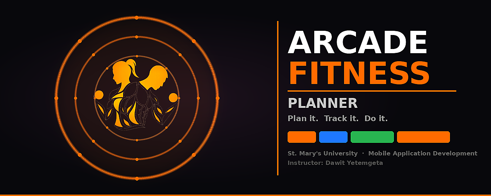

<div align="center">



# Arcade Fitness Planner

### **Plan it. Track it. Do it.**

<br/>


</div>

---

## Overview

**Arcade Fitness Planner** is a native Android application built in Java for the **Mobile Application Development** course at **St. Mary's University**. It follows the **MVVM architecture pattern** with a 7-table Room local database, LiveData-driven UI, an offline-first sync queue, and a polished dark-themed Material UI.

Users can plan workouts, browse an exercise library, track live workout sessions with set logging, monitor progress goals, and access the app as a guest before registering.

---

## Team

| Name | Role |
| ------------------- | ----------------------- |
| **Amar Abdulmejid** | Lead Developer |
| **Kaleab Dejene** | UI/UX & Frontend |
| **Kidus Kibrom** | Backend & API |
| **Yonas Ajanew** | Database & Testing |

---

## Academic Information

| Field | Details |
| --------------- | ------------------------------ |
| **Instructor** | Dawit Yetemgeta |
| **Course** | Mobile Application Development |
| **Department** | Computer Science |
| **Institution** | St. Mary's University |

---

## Development Roadmap

###  Phase 1 — Onboarding

| Screen | Status |
| ------------------- | ------------ |
| Splash Screen | ✅ Complete |
| Login Screen | ✅ Complete |
| Registration Screen | ✅ Complete |
| Dashboard Screen | ✅ Complete |

###  Phase 2 — Core MVVM Engine & Features

| Feature | Status |
| --------------------------------------- | ------------ |
| 7-Table Room Database Schema | ✅ Complete |
| MVVM ViewModels — 4 screens | ✅ Complete |
| Repository Layer — 3 repositories | ✅ Complete |
| Workout Planner (create & browse) | ✅ Complete |
| Exercise Library (filter by muscle) | ✅ Complete |
| Live Workout Tracking (timer + set log) | ✅ Complete |
| Progress & Goals Tracking | ✅ Complete |
| Offline-First Sync Queue | ✅ Complete |
| NetworkChangeReceiver | ✅ Complete |
| Guest Access Flow | ✅ Complete |
| Dark Theme UI Polish | ✅ Complete |
| Animated Splash Screen | ✅ Complete |

###  Phase 3 — Backend & Profile

| Feature | Status |
| ------------------------- | ----------- |
| Retrofit API Integration | 🔜 Pending |
| Google Sign-In | 🔜 Pending |
| User Profile Screen | 🔜 Pending |
| BMI Calculator | 🔜 Pending |
| Workout History | 🔜 Pending |
| Push Notifications | 🔜 Pending |

---

##  Project Architecture

```
app/src/main/java/com/arcadefitness/
│
├── activities/                         # All 8 screen controllers
│   ├── SplashActivity.java             # Animated entry point
│   ├── LoginActivity.java              # Email/password + guest access
│   ├── RegisterActivity.java           # Registration + guest access
│   ├── DashboardActivity.java          # Home screen, quick actions, stats
│   ├── WorkoutPlannerActivity.java     # Create & browse workout plans
│   ├── WorkoutTrackingActivity.java    # Live session timer + set logging
│   ├── ExerciseLibraryActivity.java    # Muscle group filter + browse
│   └── ProgressTrackingActivity.java   # Goals, weekly stats, sessions
│
├── viewmodel/                          # MVVM — UI state management
│   ├── DashboardViewModel.java
│   ├── WorkoutPlannerViewModel.java
│   ├── WorkoutTrackingViewModel.java
│   └── ProgressViewModel.java
│
├── data/
│   ├── local/
│   │   ├── AppDatabase.java            # Room DB — version 2, 7 entities
│   │   ├── dao/                        # 7 DAO interfaces
│   │   │   ├── WorkoutDao.java
│   │   │   ├── ExerciseDao.java
│   │   │   ├── SetRecordDao.java
│   │   │   ├── SyncQueueDao.java
│   │   │   ├── UserProfileDao.java
│   │   │   ├── GoalDao.java
│   │   │   └── WorkoutSessionDao.java
│   │   ├── entity/                     # 7 Room entity classes
│   │   │   ├── WorkoutEntity.java
│   │   │   ├── ExerciseEntity.java
│   │   │   ├── SetRecordEntity.java
│   │   │   ├── SyncQueueEntryEntity.java
│   │   │   ├── UserProfileEntity.java
│   │   │   ├── GoalEntity.java
│   │   │   └── WorkoutSessionEntity.java
│   │   └── repository/                 # LiveData-first read repositories
│   │       ├── WorkoutRepository.java
│   │       └── ExerciseRepository.java
│   ├── repository/
│   │   └── FitnessRepository.java      # Transactional writes + sync queue
│   └── remote/                         # Phase 3 — Retrofit stubs
│       ├── ApiService.java
│       └── RetrofitClient.java
│
├── adapter/                            # RecyclerView — ViewHolder pattern
│   ├── ExerciseAdapter.java
│   ├── WorkoutSessionAdapter.java
│   └── ProgressAdapter.java
│
├── network/
│   └── NetworkChangeReceiver.java      # Connectivity listener → sync flush
│
└── utils/
    ├── AppConstants.java
    ├── SessionManager.java
    └── ValidationUtils.java
```

---

##  7-Table Database Schema

```
┌─────────────────────────────────────────────────────────────┐
│                        workouts                             │
│  id · name · target_muscle_group · estimated_duration       │
│  created_at · is_synced · remote_id                         │
└──────────────┬──────────────────────────┬───────────────────┘
               │ 1:N                      │ 1:N
               ▼                          ▼
┌──────────────────────────┐  ┌──────────────────────────────┐
│     workout_sessions     │  │         set_records          │
│  id · workout_id         │  │  id · workout_id             │
│  start_timestamp         │  │  exercise_id · set_number    │
│  end_timestamp           │  │  weight · reps               │
│  duration_minutes        │  │  is_completed · timestamp    │
│  calories_burned         │  │  is_synced · remote_id       │
│  status · is_synced      │  └──────────┬───────────────────┘
└──────────────────────────┘             │ N:1
                                         ▼
                             ┌──────────────────────────────┐
                             │          exercises           │
                             │  id · name                   │
                             │  target_muscle_group         │
                             │  default_sets · default_reps │
                             │  is_synced · remote_id       │
                             └──────────────────────────────┘

┌──────────────────────┐  ┌─────────────────────┐  ┌──────────────────────┐
│     user_profiles    │  │       goals         │  │      sync_queue      │
│  id · full_name      │  │  id · title · type  │  │  id · table_name     │
│  email · age         │  │  target_value        │  │  record_id           │
│  gender · goal       │  │  current_value       │  │  operation · payload │
│  is_synced           │  │  unit · status       │  │  status              │
└──────────────────────┘  │  is_synced           │  │  attempt_count       │
                          └─────────────────────┘  └──────────────────────┘
```

**Relationships:**
- `workout_sessions.workout_id → workouts.id` (CASCADE DELETE)
- `set_records.workout_id → workouts.id` (CASCADE DELETE)
- `set_records.exercise_id → exercises.id` (CASCADE DELETE)
- `sync_queue` — flat queue, references any table by name + record_id

---

##  MVVM Data Flow

```
  ┌─────────────────────────────────┐
  │        Activity / Fragment      │  ← UI layer (no business logic)
  └────────────────┬────────────────┘
                   │ observes LiveData / calls methods
                   ▼
  ┌─────────────────────────────────┐
  │            ViewModel            │  ← State holder, survives rotation
  └────────┬────────────────┬───────┘
           │                │
    reads  │                │ writes
           ▼                ▼
  ┌──────────────┐  ┌──────────────────────┐
  │  Workout /   │  │   FitnessRepository  │  ← Transactional writes
  │  Exercise    │  │   (singleton)        │      + sync queue enqueue
  │  Repository  │  └──────────┬───────────┘
  └──────┬───────┘             │
         │                     │
         ▼                     ▼
  ┌─────────────────────────────────┐
  │          Room (SQLite)          │  ← 7-table local database
  └────────────────┬────────────────┘
                   │ on connectivity change
                   ▼
  ┌─────────────────────────────────┐
  │      NetworkChangeReceiver      │  ← BroadcastReceiver
  └────────────────┬────────────────┘
                   │ flushes pending sync_queue entries
                   ▼
  ┌─────────────────────────────────┐
  │      Retrofit / ApiService      │  ← Phase 3 remote backend
  └─────────────────────────────────┘
```

---

##  Tech Stack

| Category | Technology |
| ------------------ | ---------------------------------------- |
| **Platform** | Android API 24+ (Android 7.0 and above) |
| **Language** | Java |
| **Architecture** | MVVM + Repository Pattern |
| **UI** | XML Layouts + Material Design Components |
| **Local Database** | Room (SQLite) — 7 tables |
| **Reactive UI** | LiveData + Observer pattern |
| **Async** | ExecutorService (background threads) |
| **Networking** | Retrofit2 + OkHttp3 (Phase 3) |
| **Auth** | Email/Password local · Google (Phase 3) |
| **Build** | Gradle 9.0 · AGP 8.10 · JDK 17 |

---

##  Design System

| Token | Value | Usage |
| -------------------- | ----------- | ------------------------------ |
| **Background** | `#121212` | Screen backgrounds |
| **Card Surface** | `#1A1A1A` | Cards, list items |
| **Input Surface** | `#1C1C1C` | Text fields |
| **Primary Accent** | `#FF6B00` | Buttons, highlights, icons |
| **Text Primary** | `#FFFFFF` | Headings, labels |
| **Text Secondary** | `#888888` | Subtitles, hints |
| **Typography** | Inter | 400 · 500 · 700 · 900 weights |

---

## Local Setup & Build

### Prerequisites

- Android Studio Hedgehog (2023.1.1) or newer
- JDK 17
- Android SDK 34
- Physical device or emulator — Android 7.0+ (API 24+)

### Steps

```bash
# 1. Clone the repository
git clone https://github.com/c4realm/fitness-planner.git

# 2. Open in Android Studio
# File → Open → Select the fitness-planner folder

# 3. Sync Gradle
# Click "Sync Now" when prompted — all dependencies resolve automatically

# 4. Run on device or emulator
# Run → Run 'app'   or press Shift + F10
```

> **Note:** `google-services.json` is intentionally absent for Phase 2.
> Google Sign-In is preserved in the UI and wired to a Phase 3 placeholder.
> The app runs fully offline. Use **Browse as Guest** on the login screen
> to explore all features without an account.

---

##  License

Academic Project — **St. Mary's University © 2025**

<div align="center">

*Built with Java & Android Studio by the Arcade Fitness Planner Team*

</div>
